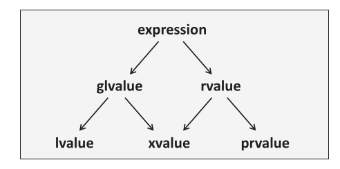

# Chapter5 强制省略拷贝或传递未实质化的对象(Mandatory Copy Elision or Passing Unmaterialized Objects)
这一章的标题来自于以下两种视角：

- 从技术上讲，C++17引入了一个新的规则：当以值传递或返回一个临时对象的时候必须
省略对该临时对象的拷贝。
- 从效果上讲，我们实际上是传递了一个 *未实质化的对象(unmaterialized object)* 。

接下来首先从技术上介绍这个特性，之后再介绍实际效果和术语 *materialization* 。

## 5.1 强制省略临时变量拷贝的动机
自从第一次标准开始，C++就允许在某些情况下 *省略(elision)* 拷贝操作，
即使这么做可能会影响程序的运行结果（例如，拷贝构造函数里的一条打印语句可能不会再执行）。
当用临时对象初始化一个新对象时就很容易出现这种情况，尤其是当一个函数以值传递或返回临时对象的时候。
例如：
```cpp
class MyClass
{
    ...
};

void foo(MyClass param) {   // param用传递进入的实参初始化
    ...
}

MyClass bar() {
    return MyClass{};       // 返回临时对象
}

int main()
{
    foo(MyClass{});     // 传递临时对象来初始化param
    MyClass x = bar();  // 使用返回的临时对象初始化x
    foo(bar());         // 使用返回的临时对象初始化param
}
```
然而，因为这种优化并不是强制性的，所以例子中的情况要求该对象必须有隐式或显式的拷贝/移动构造函数。
也就是说，尽管因为优化的原因大多数情况下并不会真的调用拷贝/移动函数，但它们必须存在。

因此，如果将上例中的`MyClass`类换成如下定义则上例代码将不能通过编译：
```cpp
class MyClass
{
  public:
    ...
    // 没有拷贝/移动构造函数的定义
    MyClass(const MyClass&) = delete;
    MyClass(MyClass&&) = delete;
    ...
};
```
只要没有拷贝构造函数就足以产生错误了，
因为移动构造函数只有在没有用户声明的拷贝构造函数(或赋值操作符或析构函数)时才会隐式存在。
（上例中只需要将拷贝构造函数定义为`delete`的就不会再有隐式定义的移动构造函数）

自从C++17起用临时变量初始化对象时省略拷贝变成了强制性的。事实上，
之后我将会看到我们我们传递为参数或者作为返回值的临时变量将会被用来
 *实质化(materialize)* 一个新的对象。
这意味着即使上例中的`MyClass`完全不允许拷贝，
示例代码也能成功编译。

然而，注意其他可选的省略拷贝的场景仍然是可选的，
这些场景中仍然需要一个拷贝或者移动构造函数。例如：
```cpp
MyClass foo()
{
    MyClass obj;
    ...
    return obj;     // 仍然需要拷贝/移动构造函数的支持
}
```
这里，`foo()`中有一个具名的变量`obj`
（当使用它时它是 *左值(lvalue)* ）。
因此， *具名返回值优化(named return value optimization)* (NRVO)会生效，
然而该优化仍然需要拷贝/移动支持。当`obj`是形参的时候也会出现这种情况：
```cpp
MyClass bar(MyClass obj)    // 传递临时变量时会省略拷贝
{
    ...
    return obj;     // 仍然需要拷贝/移动支持
}
```
当传递一个临时变量（也就是 *纯右值(prvalue)* ）
作为实参时不再需要拷贝/移动，但如果返回这个参数的话仍然需要拷贝/
移动支持因为返回的对象是具名的。

作为变化的一部分，术语值类型体系的含义也做了很多修改和说明。

## 5.2 强制省略临时变量拷贝的作用
这个特性的一个显而易见的作用就是减少拷贝会带来更好的性能。
尽管很多主流编译器之前就已经进行了这种优化，但现在这一行为有了标准的 *保证* 。
尽管移动语义能显著的减少拷贝开销，但如果直接不拷贝还是能带来很大的性能提升
（例如当对象有很多基本类型成员时移动语义还是要拷贝每个成员）。
另外这个特性可以减少输出参数的使用，转而直接返回一个值（前提是这个值直接在返回语句里创建）。

另一个作用是可以定义一个 *总是* 可以工作的工厂函数，
因为现在它甚至可以返回不允许拷贝或移动的对象。
例如，考虑如下泛型工厂函数：

```cpp
#include <utility>

template <typename T, typename... Args>
T create(Args&&... args)
{
    ...
    return T{std::forward<Args>(args)...};
}
```

这个工厂函数现在甚至可以用于`std::atomic<>`这种既没有拷贝又没有移动构造函数的类型：

```cpp
#include "factory.hpp"
#include <memory>
#include <atomic>

int main()
{
    int i = create<int>(42);
    std::unique_ptr<int> up = create<std::unique_ptr<int>>(new int{42});
    std::atomic<int> ai = create<std::atomic<int>>(42);
}
```

另一个效果就是对于移动构造函数被显式删除的类，现在也可以返回临时对象来初始化新的对象：
```cpp
class CopyOnly {
public:
    CopyOnly() {
    }
    CopyOnly(int) {
    }
    CopyOnly(const CopyOnly&) = default;
    CopyOnly(CopyOnly&&) = delete;  // 显式delete
};

CopyOnly ret() {
    return CopyOnly{};  // 自从C++17起OK
}

CopyOnly x = 42;        // 自从C++17起OK
```
在C++17之前`x`的初始化是无效的，因为 *拷贝初始化* （使用`=`初始化）
需要把`42`转换为一个临时对象，然后要用这个临时对象初始化`x`原则上需要移动构造函数，
尽管它可能不会被调用。（只有当移动构造函数 *不是* 用户自定义时拷贝构造函数才能作为移动构造函数的
备选项）

## 5.3 更明确的值类型体系
用临时变量初始化新对象时强制省略临时变量拷贝的提议的一个副作用就是，
为了支持这个提议， *值类型体系(value category)* 进行了很多修改。

### 5.3.1 值类型体系
C++中的每一个表达式都有值类型。这个类型描述了表达式的值可以用来做什么。

#### 历史上的值类型体系
C++以前只有从C语言继承而来的 *左值(lvalue)* 和 *右值(rvalue)* ，根据赋值语句划分：
```cpp
x = 42;
```
这里表达式`x`是 *左值* 因为它可以出现在赋值等号的左边，`42`是 *右值* 
因为它只能出现在表达式的右边。
然而，当ANSI-C出现之后事情就变得更加复杂了，因为如果`x`被声明为
`const int`的话它将不能出现在赋值号左边，但它仍然是一个（不能修改的）左值。

之后，C++11又引入了可移动的对象。
从语义上分析，可移动对象只能出现在赋值号右侧但它却可以被修改，
因为赋值号能移走它们的值。出于这个原因，类型 *到期值(xvalue)* 被引入，
原来的右值被重命名为 *纯右值(prvalue)* 。

#### 从C++11起的值类型体系
自从C++11起，值类型的关系见图5.1：
我们有了核心的值类型体系 *lvalue(左值)* ，
 *prvalue(纯右值)* (“pure rvalue”)和 *xvalue(到期值)* (“eXpiring value”)。
复合的值类型体系有 *glvalue(广义左值)* （“generalized lvalue”，
它是 *lvalue* 和 *xvalue* 的复合）
和 *rvalue(右值)* （ *xvalue* 和 *prvalue* 的复合）。



**lvalue(左值)** 的例子有：

- 只含有单个变量、函数或成员（除了右值的普通值成员）的表达式
- 只含有字符串字面量的表达式
- 内建的一元`*`运算符（解引用运算符）的结果
- 一个返回lvalue(左值)引用( *type&* )的函数的返回值
- 对函数的任何引用，即使使用`std::move()`标记

**prvalue(纯右值)** 的例子有：

- 除字符串字面量和用户自定义字面量之外的字面量组成的表达式
- 内建的一元`&`运算符（取地址运算符）的运算结果
- 内建的数学运算符的结果
- 一个返回值的函数的返回值
- 一个lambda表达式

**xvalue(到期值)** 的例子有：

- 一个返回rvalue(右值)引用( *type&&* )的函数的返回值
（尤其是`std::move()`的返回值）
- 把一个对象转换为rvalue(右值)引用的操作的结果
- rvalue(右值)的非静态值成员

简单来讲：

- 所有用作表达式的变量名都是 *lvalue(左值)* 。
- 所有用作表达式的字符串字面量是 *lvalue(左值)* 。
- 所有其他的字面量（`4.2, true, nullptr`）是 *prvalue(纯右值)* 。
- 所有临时对象（尤其是以值返回的对象）是 *prvalue(纯右值)* 。
- `std::move()`的结果是一个 *xvalue(到期值)* 

例如：
```cpp
class X {
};
X v;
const X c;

void f(const X&);   // 接受任何值类型
void f(X&&);        // 只接受prvalue和xvalue，但是相比上边的版本是更好的匹配

f(v);               // 给第一个f()传递了一个可修改lvalue
f(c);               // 给第一个f()传递了不可修改的lvalue
f(X());             // 给第二个f()传递了一个prvalue
f(std::move(v));    // 给第二个f()传递了一个xvalue
```
值得强调的一点是严格来讲glvalue(广义左值)、prvalue(纯右值)、xvalue(到期值)是描述表达式的术语
而 *不是* 描述值的术语（这意味着这些术语其实是误称）。例如，一个变量自身并不是左值，
只含有这个变量的表达式才是左值：
```cpp
int x = 3;  // 这里，x是一个变量，不是一个左值
int y = x;  // 这里，x是一个左值
```
在第一条语句中，`3`是一个纯右值，用它初始化了变量（不是左值）`x`。
在第二条语句中，`x`是一个左值（该表达式的求值结果指向一个包含有数值`3`的对象）。
左值`x`被转换为一个纯右值，然后用来初始化`y`。

### 5.3.2 自从C++17起的值类型体系
C++17再次明确了值类型体系，现在的值类型体系如图5.2所示：


理解值类型体系的关键是现在广义上来说，我们只有两种类型的表达式：

-  **glvaue：**  描述对象或函数 *位置* 的表达式
-  **prvalue：**  用于 *初始化* 的表达式

而 **xvalue** 可以认为是一种特殊的位置，它代表一个资源可以被回收利用的对象
（通常是因为该对象的生命周期即将结束）。

C++17引入了一个新的术语：（临时对象的） *实质化(materialization)* ，
目前prvalue就是一种临时对象。
因此， *临时对象实质化转换(temporary materialization conversion)* 
是一种prvalue到xvalue的转换。

在任何情况下prvalue出现在需要glvalue（lvalue或者xvalue）的地方都是有效的，
此时会创建一个临时对象并用该prvalue来初始化（注意prvalue主要就是用来初始化的值）。
然后该prvalue会被临时创建的xvalue类型的临时对象替换。因此上面的例子严格来讲是这样的：
```cpp
void f(const X& p); // 接受一个任何值类型体系的表达式
                    // 但实际上需要一个glvalue
f(X());             // 传递了一个prvalue，该prvalue实质化为xvalue
```
因为这个例子中的`f()`的形参是一个引用，所以它需要glvaue类型的实参。
然而，表达式`X()`是一个prvalue。此时“临时变量实质化”规则会产生作用，
表达式`X()`会“转换为”一个xvalue类型的临时对象。

注意实质化的过程中并没有创建新的/不同的对象。左值引用`p`仍然 *绑定到* 
xvalue和prvalue，尽管后者现在会转换为一个xvalue。

因为prvalue不再是对象而是可以被用来初始化对象的表达式，
所以当使用prvalue来初始化对象时不再需要prvalue是可移动的，
进而省略临时变量拷贝的特性可以完美实现。
我们现在只需要简单的传递初始值，然后它会被自动 *实质化* 来初始化新对象。

## 5.4 未实质化的返回值传递
所有以值返回临时对象(prvalue)的过程都是在传递未实质化的返回值：

- 当我们返回一个非字符串字面量的字面量时：
```cpp
int f1() {  // 以值返回int
    return 42;
}
```
- 当我们用`auto`或类型名作为返回类型并返回一个临时对象时：
```cpp
auto f2() { // 以值返回退化的类型
    ...
    return MyType{...};
}
```
- 当使用`decltype(auto)`作为返回类型并返回临时对象时：
```cpp
decltype(auto) f3() {   // 返回语句中以值返回临时对象
    ...
    return MyType{...}
}
```

注意当初始化表达式（此处是返回语句）是一个创建临时对象(prvalue)的表达式时
`decltype(auto)`将会推导出值类型。因为我们在这些场景中都是以值返回一个prvalue，
所以我们完全不需要任何拷贝/移动。

